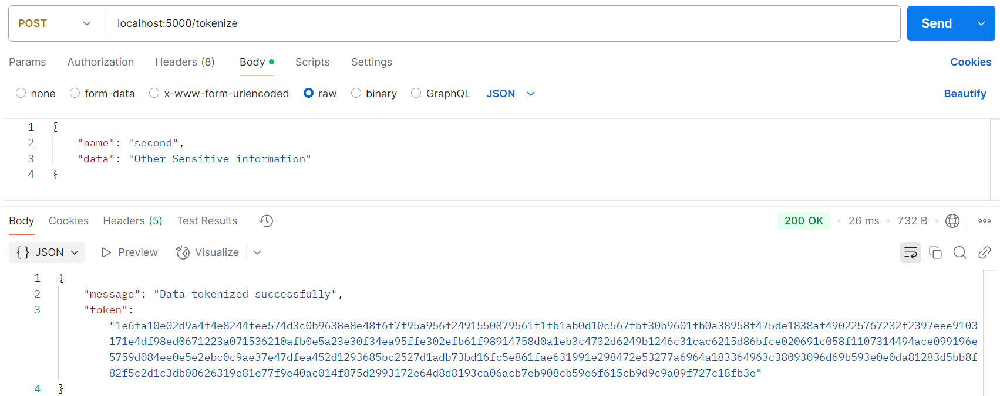
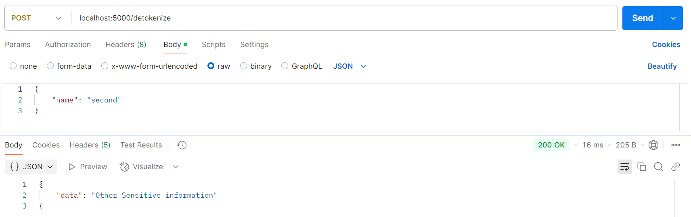

+++
title = 'Building a Vaulted Tokenization Service With Kubernetes'
date = 2025-01-28T14:22:07-05:00
[cover]
image = "kubernetes.png"
+++

## Introduction

Tokenization is a process that replaces sensitive data with non-sensitive data, typically using a reference token that maps back to the original data. This is a practice that is part of secrets management, a method of secretly storing, accessing, and managing digital secrets. 

In my pursuit of learning more about DevSecOps, I wanted to get my hands on some Kubernetes work to learn about the deployment, scaling, and management of containerized applications. Kubernetes was chosen for its ability to manage containerized applications specifically at scale. This makes it a valuable skill to have in DevOps.

In the lab covered in this post, we will create a simplified version of a vaulted tokenization service, containerize it, and host it using Kubernetes.


## Technology Stack

For the tokenization service, I created a simple flask API that tokenizes information, stores it, and allows the information to be detokenized and retrieved. This application came to mind as a simple API I could set up, and is even reminiscent of the capstone work from senior year!

To set up Kubernetes I used Minikube. Minikube is an open source tool that allows developers to spin up a local cluster, eliminating the cost and complexity of the cloud when testing. For development, this tool is invaluable. 

Finally for containerization, like last weeks Lab I am using Docker.

## Tokenization Workflow

The tokenization service supports two functions:

- Tokenization: Users send a `POST` request with a  `name` and `data`. The data is encrypted using a public key and stored in a YAML file alongside the token name.
- Detokenization: Users send a `POST` request with a `name`. The token associated with the name is retrieved from the YAML file, decrypted using the private key, and returned to the user.


## Setting Up Kubernetes

To host this with Kubernetes, we first create a cluster using Minikube.
```powershell
minikube start –driver=docker
```

This will spin up the Kubernetes cluster, preparing us to load pods with containers to run and administrate. To achieve this, we must create YAML files to configure our pods, services, and deployment.

The first YAML file is the deployment.yaml file. Some of the most important specifications in this file are the declaration of container name and image for our application, container port for its networking, and volume mounts for access to saving tokens. More specifics on this can be found in the [official docs](https://kubernetes.io/docs/concepts/workloads/controllers/deployment/).


`deployment.yaml`:
```YAML
apiVersion: apps/v1
kind: Deployment
metadata:
  name: tokenization-service
spec:
  replicas: 1
  selector:
    matchLabels:
      app: tokenization-service
  template:
    metadata:
      labels:
        app: tokenization-service
    spec:
      containers:
      - name: tokenization-service
        image: tokenization-service:latest
        imagePullPolicy: Never
        ports:
        - containerPort: 5000
        volumeMounts:
        - name: app-data
          mountPath: /app/saves
      volumes:
        - name: app-data
          emptyDir: {}
```

NOTE: the `volumeMounts` ensures the file for token storage is persistent. This deployment also has `imagePullPolicy: Never` so as to not hang in attempting to pull an image.

The next YAML file is the service.yaml file. This, like the previous file, offers configuration but for the service API for Kubernetes. A service makes an endpoint and declares how the pods are accessible. In our case, we specify some metadata, port protocol, and port numbers.

`service.yaml`:
```YAML
apiVersion: v1
kind: Service
metadata:
  name: tokenization-service
spec:
  selector:
    app: tokenization-service
  ports:
    - protocol: TCP
      port: 5000
      targetPort: 5000
  type: NodePort
```


## Deployment

For this lab environment, the Docker image is loaded directly into the Minikube cluster. In a production environment, images are typically hosted in a container registry such as Docker Hub or AWS ECR.

To begin deployment, the docker image is built and loaded locally.

```powershell
docker build -t tokenization-service .
minikube image load tokenization-service:latest
```

We then apply our Kubernetes configurations, `deployment.yaml` and `service.yaml`.

```powershell
kubectl apply -f deployment.yaml
kubectl apply -f service.yaml
```

This will begin the creation of the pods we specified and start containers for the service. Just like that a single node Kubernetes cluster running a custom application.

### Tokenization


### Detokenization


## Lessons Learned

Kubernetes is highly configurable. This means there are many opportunities to make mistakes. I spent a lot of time chasing errors and going over configuration files. Because of this granularity in configuration there exists many Kubernetes tools! [This](https://medium.com/@petolofsson/supercharge-your-kubernetes-workflow-with-essential-tools-starship-kubectx-kubecolor-and-k9s-c2ce5eb88d23) article is a great introduciton to that world.

## Conclusion

This project provided me with valuable experience in Kubernetes and DevSecOps principles. I have a much better understanding of Kubernetes and some new found comfort working with it.