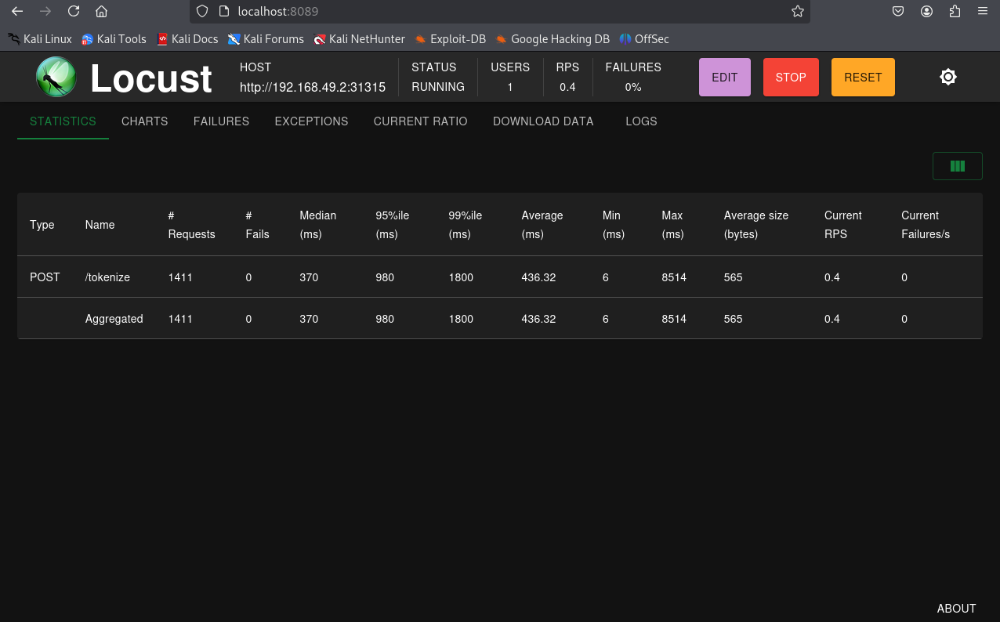
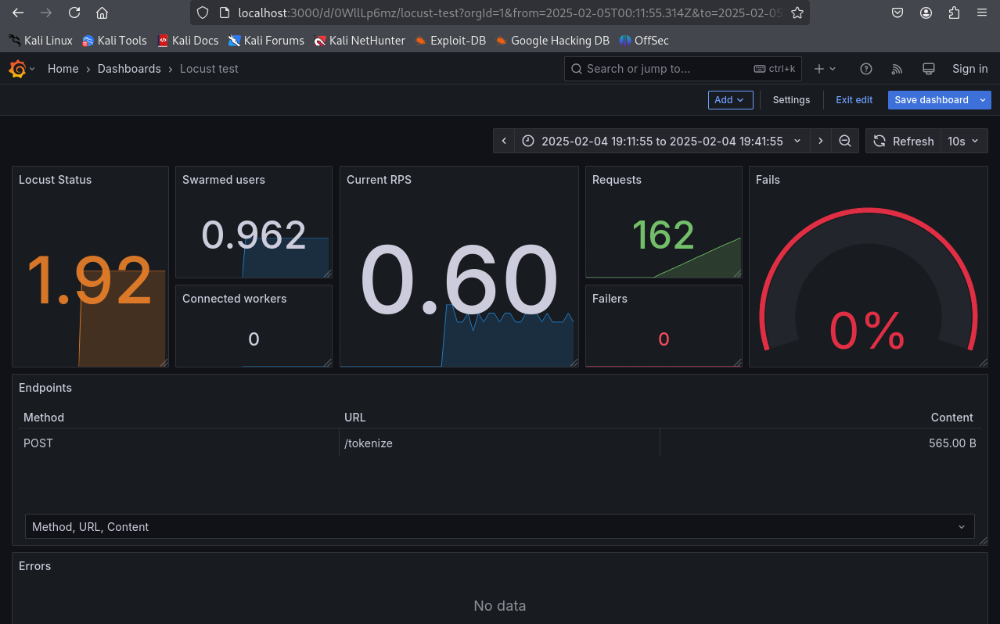

+++
date = '2025-02-05T17:50:10-05:00'
title = 'Monitor Lab'
+++

## Introduction

Monitoring in DevSecOps is a step that produces continuous observations and analysis of an information system. In the continued pursuit of my DevSecOps learning, I set to monitor my own application to better understand the process of DevOps and how security is intertwined.

While competing in the Collegiate Cyber Defense Competition, or CCDC, I spent a lot of precious time looking through logs trying to paint a picture of a current systems health. This was a last resort when our centralized logging system was compromised or unavailable, and often times was prone to having an important log slip right past. There is however an entire landscape of applications geared towards painting this picture for you. Enter monitoring.

## Monitoring In DevSecOps

Monitoring in DevSecOps is the continuous process of actively tracking and analyzing system performance and security across the SDLC. Data is collected from aspects like applications, infrastructure, and services to give real time insight into health, performance, and system status. The goal is to encourage proactive issue detection and a rapid response to problems.

## Setting Up the Lab

### Tools

A tool called [Locust](https://locust.io/) is a python-based load generating tool that is highly configurable. Using Python code, tests can be defined to fit your exact needs providing real time data. This will be used to simulate usage on an application in this lab.

A [Locust exporter](https://github.com/ContainerSolutions/locust_exporter) will also be used to expose metrics gathered in a Prometheus-compatible format.

[Prometheus](https://prometheus.io/) is a monitoring tool that can collect and store metrics from application and infrastructure. Metrics are stored with a timestamp and stored them by name and key-value pairs. Prometheus will collect and store the metrics gathered from the Locust forwarder.

[Grafana](https://grafana.com/) visualizes data from sources and displays it to a dashboard. Dashboards can have graphs, charts, histograms, geomaps and even heatmaps. Grafana will visualize all of our metrics from Prometheus.

Finally, our [service](http://karl.trowbridge1.github.io/blog/buildingavaultedtokenizationservicewithkubernetes/) itself will be the Kubernetes pod from last week!


### Configuring Locust

To run Locust I wrote a custom script to interface with the Tokenization Service:


`locustfile.py`:
```python
from locust import HttpUser, task, between
import random

class TokenizationServiceUser(HttpUser):
    wait_time = between(1, 2)
    
    @task
    def create_token(self):
        token_name = f"token_{random.randint(1, 1000)}"
        self.client.post("/tokenize", json={
                                        "name": token_name,
                                        "data": "example sensitive info"
                                        })
```

This specific `locustfile.py` shows the use of the tokenization endpoint on the service I wrote last week is going to be tested. We first define the `@task` in a users class. When the users run, a `task` is picked, executed, then sleeps for some time, and the cycle begins again. In our case, a set token name and data pair is set with a randomly generated token.

With the `locustfile.py` in the working directory we can run Locust:

```bash
locust --host http://k8s-service-url:port --web-host 0.0.0.0
```

This hosts our locust webapp:



When we run the test, information is obtained by this script and hosted on  port `8089`. To export this information in a readable format for Prometheus we can then use a docker container from container solutions, locust exporter:

```yml
locust-metrics-exporter:
    image: containersol/locust_exporter
    ports:
        - "9646:9646"
    environment:
        - LOCUST_EXPORTER_URI=http://locust-address:8089
```

With this new service, metrics are hosted and and now readable for Prometheus


### Configuring Prometheus

Prometheus is ran in another docker container with the following compose file:

```yml
services:
  prometheus:
    image: prom/prometheus
    ports:
      - "9090:9090"
    volumes:
      - /home/kali/Monitor Lab/prometheus/prometheus.yml:/etc/prometheus/prometheus.yml
```

It is important to configure Prometheus to scrape the infromation being hosted, in this case it is our Locust Exporter. To acheive that a mount is created in a volume with the custom configuration that points to the Locust exporter. These are the additions made to the Prometheus config file at `/etc/prometheus/prometheus.yml` in the Prometheus container.

`prometheus.yml` additions:
```yml
global:
scrape_configs:
  - job_name: 'prometheus_scrapper'
    static_configs:
      - targets: ['locust-exporter-address:9646']
```

With that, Prometheus starts up:


### Configuring Grafana

With the tokenization service running, the stress test underway, metrics being collected, then exported, and the data collected it is time to visualize it with Grafana. Spinning up a docker container we can interact with the web application:

```yml
version: "3.8"
services:
  grafana:
    image: grafana/grafana
    ports:
      - "3000:3000"
    environment:
      - GF_AUTH_ANONYMOUS_ENABLED=true
      - GF_AUTH_ANONYMOUS_ORG_ROLE=Admin
      - GF_SECURITY_DISABLE_LOGIN_FORM=true
```

From here we configure a data source to give Grafana the metrics to visualize. There is an option specifically for Prometheus that is then configured to point towards the Promethius address. Grafana then saves and tests this configuration and confirms connection.

Finally, a dashboard is needed. The dashboard is a collection of panels that display the data collected from a data source in charts, graphs, and other visualizations. This displays a full picture that is easy to understand and very intuitive. For speed and ease there are pre-made dashboards, [including one specifically designed for Locust Tests](https://grafana.com/grafana/dashboards/11985-locust-test/). This specific dashboard can be accessed but the ID 11985. Pretty slick:



Just like that, metrics visualized and displayed!

## Monitoring in DevSecOps

This simple lab displaying the visualization of usage messages fron my own Kubernetes Pod has given a look into the Monitor Step in DevSecOps and what it has to offer. Metrics can highlight the health of an information system, specifically with issue detection and security insight. Specific metrics can indicate bottlenecks before deployment like high response times under load, or a resource exhaustion for containers. Other metrics can highlight attacks or vulnerabilities such as unexpected spikes in traffic, unusual API request patters, or anomalous failures of specific endpoints. All of this information available at a glance creates an excellent feedback loop for security professionals and system engineers alike.
